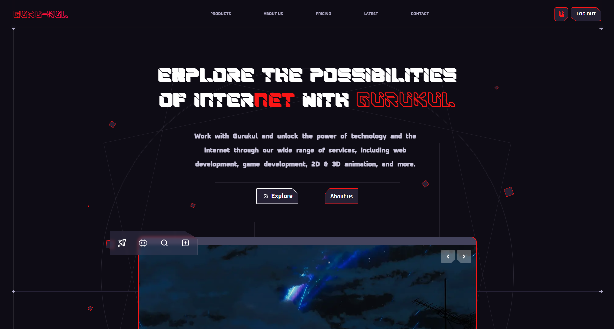

  

# ✨ Gurukul Web App

This is a frontend react website with modern UI

---

## 📁 Project Structure

Gurukul/
├── frontend/
│ ├── public/
│ ├── src/
│ ├── index.html
│ ├── package.json
│ ├── tailwind.config.js
│ └── vite.config.js
└── README.md

---

## 🚀 Features

- 🎨 Modern responsive UI with **Tailwind CSS**
- ⚛️ Built using **React 19**, **Framer Motion**, **Zustand**, and more
- 📦 Vite bundler for blazing-fast frontend development
- 🔧 ESLint setup for consistent code quality

---

## 🛠️ Tech Stack

**Frontend:**
- React 19
- Vite
- Tailwind CSS
- Zustand, Swiper, Framer Motion, Lucide Icons
- Axios, Toast Notifications
- formspree

📦 Installation & Setup
💻 Frontend
bash
Copy
Edit
cd frontend
npm install
npm run dev
🌍 Live Demo
Add your deployed URL here
Example: https://Gurukul-project.vercel.app

👤 Author
Name: Gurukul

Location: Vasai [E], Maharashtra, India

Email: example@gmail.com

📄 License
This project is licensed under the MIT License.

🧠 Contributions
Pull requests are welcome. For major changes, please open an issue first to discuss what you would like to change.